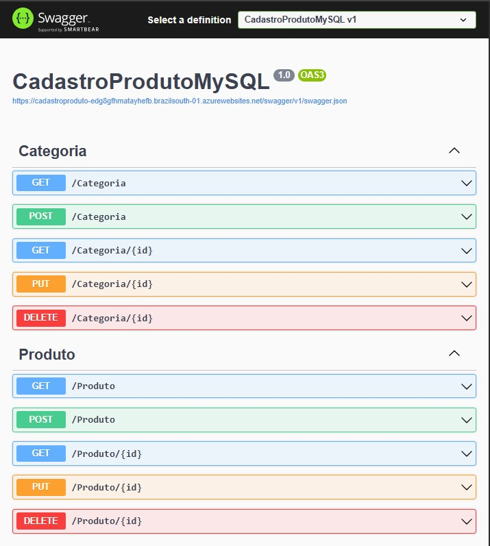
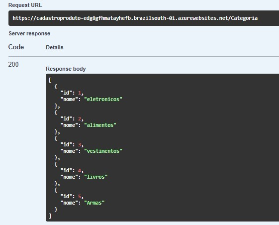
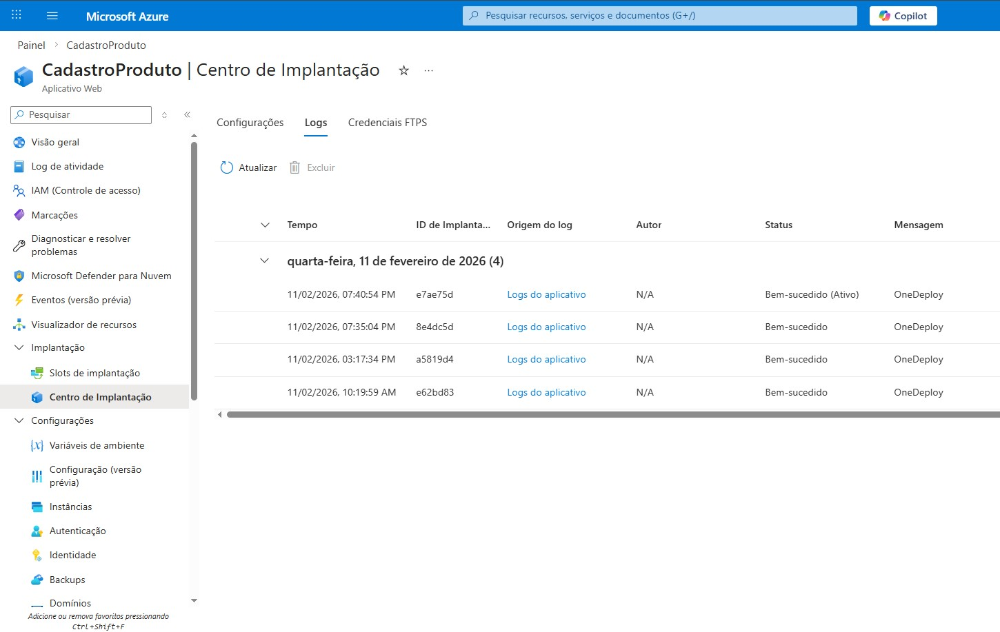
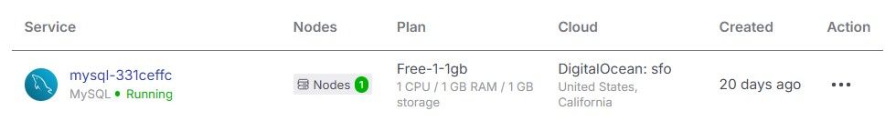
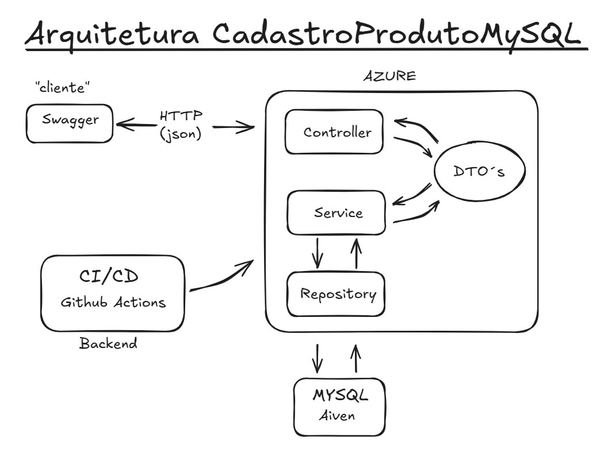

 # CadastroProdutoMySQL

Essa é uma API RESTful para gestão de produtos, desenvolvida em ASP.NET Core, com persistência em MySQL utilizando ADO.NET, arquitetura em camadas e deploy automatizado no Azure via GitHub Actions.

---
# Imagens

1. Tela inicial de execução no Swagger:
- 
2. Tela da resposta de uma busca pelos produtos cadastrados:
- 
3. Tela da resposta de uma busca pelas categorias cadastrados:
- 
4. Tela do centro de implantacão no Azure:
- 
5. Tela do MySQL rodando no Aiven:
- 
6. Diagrama de arquitetura do projeto: Client → Controller → Service → Repository → MySQL
- 

---

 # Demo:
 https://cadastroproduto-edg8gfhmatayhefb.brazilsouth-01.azurewebsites.net/swagger/index.html

---

## Tecnologias Utilizadas:
- **C#**
- **.NET 8/ ASP.NET Core**
- **MySQL 8**
- **ADO.NET**
- **Azure App Service**
- **GitHub Actions (CI/CD)**
- **Swagger / OpenAPI**.

---

## Arquitetura:
 - Arquitetura em camadas, separando responsabilidades:
 Controller → Service → Repository → Database

Com uso de:
- **DTOs (Data Transfer Objects)**
- **Injeção de dependência**
- **Validações de entrada**
- **Tratamento de erros**
- **Organização por namespaces**

---

## Funcionalidades:

- **Listagem de produtos**.
- **Cadastro de Produtos**.
- **Busca de Produto por ID**.
- **Atualização de Produto por ID**.
- **Remoção de Produtos por ID**.

- **Listagem de Categoria**.
- **Cadastro de Categoria**.
- **Busca de Categoria por ID**.
- **Atualização de Categoria por ID**.
- **Remoção de Categoria por ID**.

---

## Estrutura do projeto:
CadastroProdutoMySQL
- CONTROLLERS/ # Controladores da API
- DTOS/ # Objetos de Transferência de Dados
- MODELOS/ # Modelos de domínio
- REPOSITORY/ # Repositório para acesso ao banco de dados
- SERVICOS/ # Regras de negócios e lógica de aplicação
- appsettings.json # Configurações de ambiente e banco
- Program.cs # Ponto de entrada da aplicação

---

## CI/CD
- Pipeline automatizado configurado com GitHub Actions:
- Build da aplicação
- Teste de compilação
- Deploy automático no Azure a cada push na branch principal
- Fluxo real de entrega contínua (CD).

---

## Endpoints

### Produtos
- `Get /produto` - Lista todos os produtos.
- `Get /produto/{id}` - Busca produto por ID. 
- `POST /produto` - Cadastra novo produto. 
- `PUT /produto/{id}` - Atualiza produto por ID. 
- `DELETE /produto/{id}` - Remove produto por ID. 

### Categorias
- `GET /acategoria` - Lista todas as categorias.
- `GET /categoria/{id}` - Busca categorias por ID.
- `POST /categoria` - Cadastra nova categoria.
- `PUT /categoria/{id}` - Atualiza categoria por ID. 
- `DELETE /categoria/{id}` - Remove categoria por ID. 

---

## Como rodar localmente:
Pré-requisitos:
- .NET 8 SDK
- MySQL Server
- Visual Studio ou VS Code

1. Clone o repositório: 
[GitHub](https://github.com/TonyBranquinho/CadastroProdutoMySQL)
2. Configure a string de conexão no appsettings.json:
"ConnectionStrings": {"DefaultConnection": "server=localhost;database=cadastro_produto;user=root;password=suasenha"}
3. Execute o projeto:
4. Acesse o Swagger para testar os endpoints:
[https://localhost:7128/swagger/index.html](https://localhost:7128/swagger/index.html)

---

## Melhorias futuras, e que estão sendo implementadas:
- Implementar autenticação JWT.
- Implementar validações de entrada mais robustas. 
- Criar testes automatizados (xUnit).

**Autor:** Tony Branquinho
[LinkedIn](https://www.linkedin.com/in/jeferson-branquinho/)
[GitHub](https://github.com/TonyBranquinho)

---
## Licença
Este projeto está sob a licença MIT. Consulte o arquivo [LICENSE](LICENSE) para mais detalhes.
